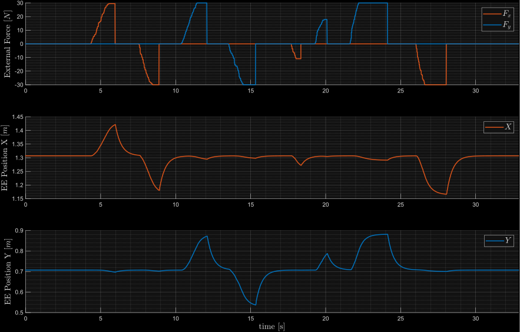
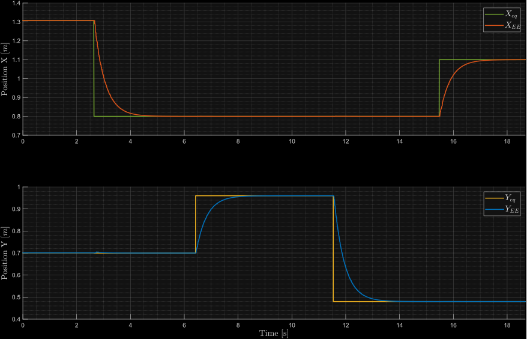

# Lab 4: Impedance Control

Este repositorio contiene la implementación en ROS 2 (C++) de un Controlador de Impedancia Cartesiana para un manipulador RR. El sistema adopta una arquitectura de control de dos niveles: un lazo interno para la compensación y cancelación de la dinámica no lineal del brazo, y un lazo externo que impone un comportamiento mecánico virtual (masa-muelle-amortiguador) en el espacio operacional frente a fuerzas externas.

---

## Compilación y Ejecución
Clona este repositorio dentro de la carpeta `src` de tu espacio de trabajo de ROS 2 y compila el paquete:
```bash
cd ~/ros/amp_rob_ws/src
git clone https://github.com/rumonru05-byte/impedance_control.git
cd ~/ros/amp_rob_ws
colcon build --packages-select uma_arm_control
source install/setup.bash
```

&nbsp;

### Experimento 1: Aplicación de fuerzas virtuales al robot
Para observar el comportamiento del control de impedancia ante colisiones o fuerzas externas, es necesario lanzar los siguientes nodos en diferentes terminales (el orden de ejecución es importante):

1. Visualización en RViz:
```bash
ros2 launch uma_arm_description uma_arm_visualization.launch.py
```

2. Controlador de Impedancia (Lazo externo):
```bash
ros2 launch uma_arm_control impedance_controller_launch.py
```

3. Cancelación de Dinámica (Lazo interno):
```bash
ros2 launch uma_arm_control dynamics_cancellation_launch.py
```

4. Publicador de Fuerzas Externas:
```bash
cd ~/ros/amp_rob_ws/src/uma_arm_control/utils
python3 wrench_trackbar_publisher.py 
```

5. Dinámica del manipulador (Planta real):
```bash
ros2 launch uma_arm_control uma_arm_dynamics_launch.py
```

&nbsp;

### Experimento 2: Modificación de la pose de equilibrio
Para evaluar cómo el robot transita hacia un nuevo punto cartesiano de equilibrio manteniendo su comportamiento _compliant_, lanza el mismo entorno anterior y añade el publicador de posición de equilibrio en otra terminal (antes de lanzar el `uma_arm_dynamics_launch.py`):
```bash
cd ~/ros/amp_rob_ws/src/uma_arm_control/utils
python3 equilibrium_pose_publisher.py
```
Los parámetros virtuales del controlador de impedancia, como la Masa $M$, Amortiguación $B$ y Rigidez $K$, se configuran a través del archivo `impedance_params.yaml`.

---

## Descripción de la Implementación
El núcleo matemático del proyecto se encuentra en el nodo `impedance_controller.cpp`. Como las fuerzas y las coordenadas deseadas operan en el espacio cartesiano, pero el robot se mueve mediante consignas articulares, el nodo realiza las siguientes conversiones matemáticas en cada iteración del bucle de control:

1. **Cinemática Directa:** Calcula la pose cartesiana actual del efector final a partir de los ángulos de las articulaciones.

$$x = \begin{bmatrix} l_1\cos(q_1) + l_2\cos(q_1+q_2) \\ 
l_1\sin(q_1) + l_2\sin(q_1+q_2) \end{bmatrix}$$

2. **Cálculo del Jacobiano y su Derivada:**

$$J(q) = \begin{bmatrix} -l_1\sin(q_1)-l_2\sin(q_1+q_2) & -l_2\sin(q_1+q_2) \\
l_1\cos(q_1)+l_2\cos(q_1+q_2) & l_2\cos(q_1+q_2) \end{bmatrix}$$

$$\dot{J}(q,\dot{q}) = \begin{bmatrix} -l_1\cos(q_1)\dot{q}_1-l_2\cos(q_1+q_2)(\dot{q}_1+\dot{q}_2) & -l_2\cos(q_1+q_2)(\dot{q}_1+\dot{q}_2) \\ 
-l_1\sin(q_1)\dot{q}_1-l_2\sin(q_1+q_2)(\dot{q}_1+\dot{q}_2) & -l_2\sin(q_1+q_2)(\dot{q}_1+\dot{q}_2) \end{bmatrix}$$

3. **Cinemática Diferencial de Primer Orden:** Extrae la velocidad cartesiana actual del efector final.
$$\dot{x} = J(q)\dot{q}$$

4. **Controlador de Impedancia (Modelo de Segundo Orden):** Se define el error de posición $\tilde{x} = x - x_d$ y de velocidad $\dot{\tilde{x}} = \dot{x} - \dot{x}_d$. Asumiendo que la velocidad deseada es nula, el modelo dinámico deseado es:

$$M\ddot{\tilde{x}} + B\dot{\tilde{x}} + K\tilde{x} = F_{ext}$$

&emsp;&emsp;Despejando la aceleración cartesiana de salida $\ddot{x}_d$:

$$\ddot{x}_d = M^{-1}(F_{ext} - B\dot{\tilde{x}} - K\tilde{x})$$

5. **Cinemática Diferencial Inversa de Segundo Orden:** Mapea la aceleración cartesiana calculada por el control de impedancia a una consigna de aceleración articular ($\ddot{q}_d$) para enviarla al nodo de cancelación dinámica:

$$\ddot{q}_d = J(q)^{-1}[\ddot{x}_d - \dot{J}(q,\dot{q})\dot{q}]$$

---

## Resultados y Gráficas
A continuación se expone el comportamiento general del brazo manipulador frente a perturbaciones y cambios de referencia, utilizando los parámetros de impedancia base.

### 1. Aplicación de Fuerzas Externas (_Experimento 1_)
Al inyectar fuerzas virtuales a través del publicador, el robot reacciona cediendo ante la presión y volviendo asintóticamente a su pose original al cesar la fuerza, comportándose como un sistema _compliant_ (masa-muelle-amortiguador virtual).

Como se puede observar en las gráficas resultantes, la respuesta del controlador base presenta un **acoplamiento dinámico**: al aplicar una perturbación estrictamente ortogonal en un eje (por ejemplo, empujar solo en X), las inercias cruzadas del brazo físico provocan un desplazamiento no deseado en el eje Y. 

> **_Nota:_** El análisis matemático de este fenómeno (cross-coupling) y la implementación de su solución (desacoplamiento total mediante la cancelación de fuerzas en el lazo interno) se documentan y resuelven en la **[Wiki de este repositorio](https://github.com/rumonru05-byte/impedance_control/wiki)**.

<table>
  <tr>
    <td align="center">
      <strong>Robot cediendo ante fuerzas virtuales</strong><br>
      
    </td>
  </tr>
  <tr>
    <td align="center">
      <strong>Fuerzas aplicadas vs Posición en X e Y del EE (Acoplamiento visible)</strong><br>
      
    </td>
  </tr>
</table>
En las gráficas se observa cómo, al aplicar una fuerza ortogonal en un eje, se produce una perturbación acoplada en la posición del otro. Por ejemplo, en $t=12s$, es evidente una desviación en la posición del eje $X$ al aplicar una fuerza neta exclusiva en el eje $Y$. Este comportamiento indeseado de acoplamiento dinámico se ha mitigado mejorando la cancelación de la dinámica y añadiendo la compensación de estas fuerzas externas en el lazo interno (<code>dynamics_cancellation.cpp</code>).

&nbsp;

### 2. Modificación de la Pose de Equilibrio (_Experimento 2_)
En este segundo experimento, en lugar de perturbar externamente al robot, se modifica dinámicamente la coordenada cartesiana de referencia. El controlador de impedancia gestiona la transición espacial, asegurando que el efector final alcance la nueva posición de equilibrio de forma suave y regulada por la amortiguación del sistema, sin generar movimientos inestables o sobreimpulsos.

<table>
  <tr>
    <td align="center">
      <strong>Transición de la pose de equilibrio</strong><br>
      
    </td>
  </tr>
  <tr>
    <td align="center">
      <strong>Posición del EE (Real vs Referencia)</strong><br>
      
    </td>
  </tr>
</table>
